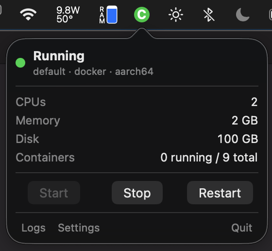

# ColimaSwift

A macOS menu bar app for controlling and monitoring a local [Colima](https://github.com/abiosoft/colima) VM.



## Requirements

- macOS 13+ (arm64)
- [Colima](https://github.com/abiosoft/colima) installed via Homebrew

## Build & run

```bash
make          # Build ColimaSwift.app into build/
make run      # Build and launch
make clean    # Remove build/
```
